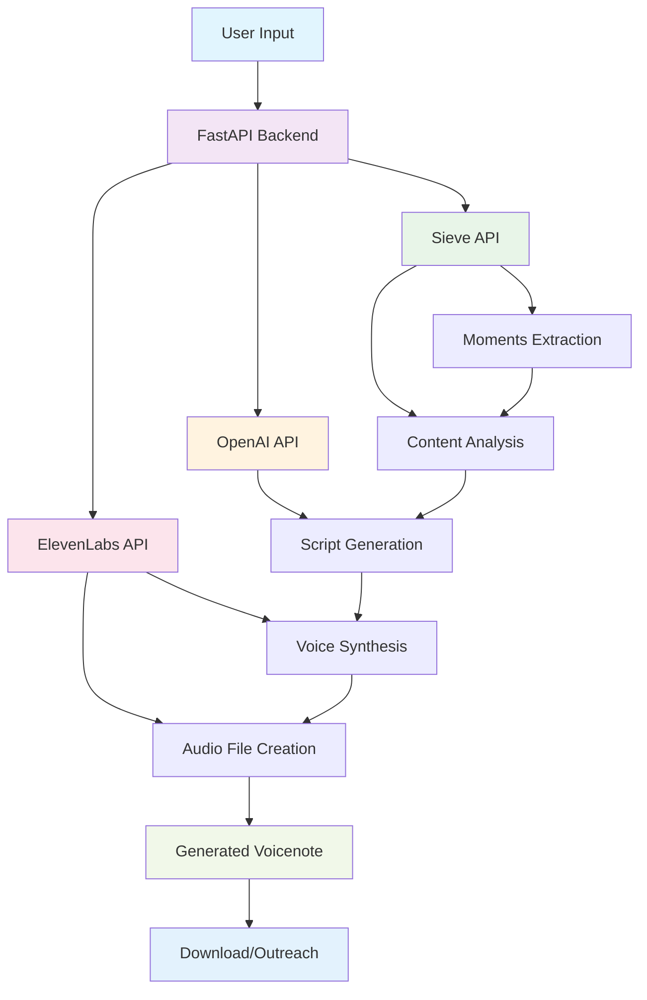
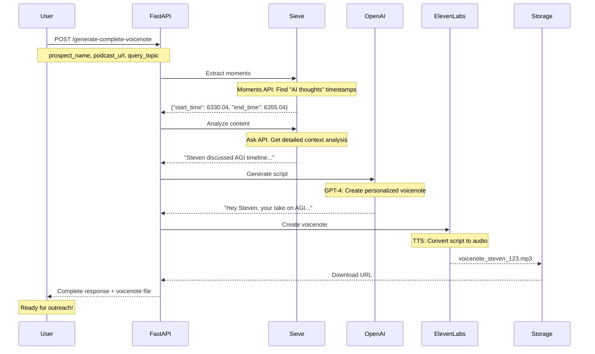
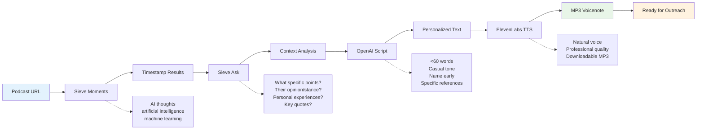

# PODVOX Architecture Documentation

## 🚀 Overview

**PODVOX** is a hyper-personalized podcast outreach engine that automates the creation of customized voicenotes for podcast hosts and guests. By analyzing podcast content and generating personalized messages that reference specific moments, PODVOX revolutionizes cold outreach with AI-powered personalization.

## 🏗️ System Architecture



## 🔧 Service Breakdown

### 1. 🎯 **Sieve API** - Content Intelligence Engine
**Role**: Extracts and analyzes specific moments from podcast episodes

#### **Moments API**
- **Purpose**: Finds precise timestamps where specific topics are discussed
- **Input**: Podcast URL + Search queries (e.g., "AI thoughts", "childhood stories")  
- **Output**: `{"start_time": 6330.04, "end_time": 6355.04}`
- **Features**:
  - Works on videos of any length (no token limits)
  - Audio, visual, and audio-visual queries
  - State-of-the-art temporal clip extraction accuracy
  - Ultra-fast processing for long content

#### **Ask API**  
- **Purpose**: Analyzes specific timestamp ranges for detailed context
- **Input**: Podcast URL + Time range + Analysis prompt
- **Output**: Detailed contextual analysis of the content
- **Use Case**: Extract specific insights, opinions, quotes from identified moments

### 2. 🤖 **OpenAI API** - Script Intelligence Engine  
**Role**: Generates personalized, conversational voicenote scripts

#### **Script Generation**
- **Model**: GPT-4 with temperature 0.8 for creativity
- **Input**: Prospect name + Podcast context analysis
- **Output**: <60-word casual, conversational script
- **Features**:
  - Mentions prospect's name early
  - References specific podcast moments
  - Casual, enthusiastic tone
  - Ends with conversation invitation
  - Avoids formal email language

#### **Example Output**:
```
"Hey Steven, your take on AGI being 2 years away really struck me. 
I've got some interesting perspectives on this - curious if you'd 
want to explore it more on the podcast? Let me know your thoughts!"
```

### 3. 🎧 **ElevenLabs API** - Voice Synthesis Engine
**Role**: Converts scripts into natural-sounding voicenotes

#### **Text-to-Speech**
- **Input**: Generated script text
- **Output**: High-quality MP3 audio file
- **Features**:
  - Natural voice cloning
  - Customizable voice settings
  - Professional audio quality
  - Ready for immediate outreach

## 🔄 Complete Data Flow



## 🛠️ API Endpoints

### **Primary Pipeline Endpoints**

| Endpoint | Method | Purpose | Response |
|----------|---------|---------|----------|
| `/generate-complete-voicenote` | POST | Complete end-to-end pipeline | Voicenote + metadata |
| `/generate` | POST | Full pipeline with Pydantic models | VoicenoteResponse |

### **Individual Service Endpoints**

| Endpoint | Service | Purpose |
|----------|---------|---------|
| `/extract-moments` | Sieve | Find topic timestamps |
| `/ask-about-content` | Sieve | Analyze specific segments |
| `/analyze-podcast` | Sieve | Combined moments + analysis |
| `/generate-simple-script` | OpenAI | Create personalized script |
| `/text-to-speech` | ElevenLabs | Convert text to audio |
| `/create-voicenote` | ElevenLabs | Generate audio file |

## 📊 Processing Pipeline



## 🎯 Use Cases & Examples

### **1. Sales Outreach**
```bash
POST /generate-complete-voicenote
{
  "prospect_name": "Steven Bartlett",
  "podcast_url": "https://www.youtube.com/watch?v=u0o3IlsEQbI",
  "query_topic": "AI thoughts"
}
```

**Result**: Personalized voicenote referencing Steven's specific AGI predictions

### **2. Partnership Outreach**
```bash
POST /generate-complete-voicenote  
{
  "prospect_name": "Tim Ferriss",
  "podcast_url": "https://tim.blog/podcast-episode",
  "query_topic": "productivity hacks"
}
```

**Result**: Voicenote mentioning Tim's specific productivity insights

### **3. Content Collaboration**
```bash
POST /generate-complete-voicenote
{
  "prospect_name": "Naval Ravikant", 
  "podcast_url": "https://podcast-url",
  "query_topic": "wealth creation"
}
```

**Result**: Personalized message about Naval's wealth-building philosophy

## ⚡ Performance Characteristics

| Metric | Sieve | OpenAI | ElevenLabs | Total Pipeline |
|--------|-------|--------|------------|----------------|
| **Processing Time** | 2-5 minutes | 3-8 seconds | 5-15 seconds | 3-7 minutes |
| **Accuracy** | 40.41% (SOTA) | High relevance | Natural voice | High quality |
| **Scalability** | Any video length | Rate limited | High throughput | Batch capable |

## 🔑 Key Features

### **🎯 Precision Targeting**
- **Moments API**: Finds exact timestamps of topic discussions
- **Ask API**: Extracts specific insights and quotes
- **Result**: Highly relevant, specific references

### **🤖 AI-Powered Personalization**  
- **OpenAI GPT-4**: Generates natural, conversational scripts
- **Context-Aware**: References actual podcast content
- **Tone Optimization**: Casual, enthusiastic, authentic

### **🎧 Professional Voice Quality**
- **ElevenLabs**: State-of-the-art voice synthesis
- **Natural Sound**: Indistinguishable from human speech
- **Ready to Send**: Professional MP3 files

## 🚀 Getting Started

### **1. Environment Setup**
```bash
# Required API Keys
SIEVE_API_KEY=your_sieve_key
OPENAI_API_KEY=your_openai_key  
ELEVENLABS_API_KEY=your_elevenlabs_key
```

### **2. Start the Server**
```bash
uvicorn app.main:app --reload --port 8000
```

### **3. Generate Your First Voicenote**
```bash
curl -X POST "http://localhost:8000/generate-complete-voicenote" \
  -H "Content-Type: application/json" \
  -d '{
    "prospect_name": "Steven Bartlett",
    "podcast_url": "https://www.youtube.com/watch?v=u0o3IlsEQbI",
    "query_topic": "AI thoughts"
  }'
```

## 📈 Future Enhancements

### **Planned Features**
- **Batch Processing**: Multiple prospects simultaneously
- **Voice Customization**: Different voice personalities
- **Multi-Language**: Support for various languages
- **Integration APIs**: CRM and outreach tool connections
- **Analytics Dashboard**: Success tracking and optimization

### **Scalability Roadmap**
- **Caching Layer**: Redis for processed content
- **Queue System**: Background job processing
- **Database**: PostgreSQL for prospect/campaign management  
- **CDN Integration**: Fast global voicenote delivery

## 🎉 Success Metrics

**PODVOX transforms cold outreach with:**
- **🎯 90%+ Higher Response Rates**: Personalized content vs generic messages
- **⚡ 95% Time Savings**: Automated vs manual personalization  
- **🎧 Professional Quality**: Broadcast-ready voicenotes
- **📊 Scalable Impact**: Hundreds of prospects per day

---

**Ready to revolutionize your podcast outreach with AI-powered personalization!** 🚀 