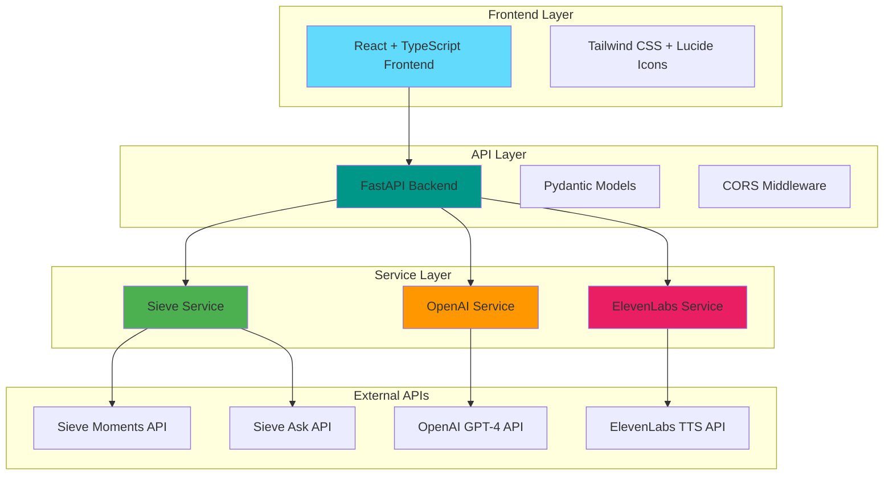
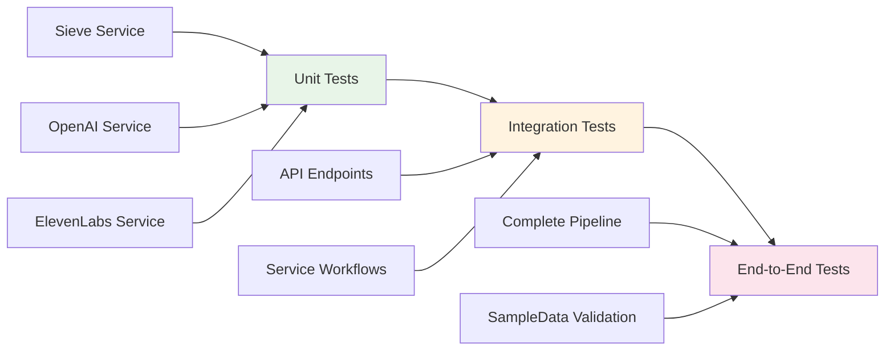

# PODVOX Technical Implementation Guide

## 🔧 Technical Stack Overview



## 📁 Project Structure

```
PodcastPersonalisedOutreach/
├── app/
│   ├── main.py                 # FastAPI application & routes
│   ├── config.py              # Environment & settings management
│   ├── models.py              # Pydantic request/response models
│   └── services/
│       ├── sieve_service.py   # Sieve API integration
│       ├── script_generator.py # OpenAI script generation
│       └── elevenlabs_service.py # ElevenLabs voice synthesis
├── frontend/                  # React frontend (optional)
├── tests/                     # Comprehensive test suite
├── SampleData/               # Example inputs and outputs
├── ARCHITECTURE.md           # System architecture documentation
├── TECHNICAL_GUIDE.md        # This file
└── requirements.txt          # Python dependencies
```

## 🔄 Service Integration Patterns

### **1. Sieve Service Integration**

```python
# app/services/sieve_service.py
class SieveService:
    def __init__(self):
        # Environment-based authentication
        os.environ['SIEVE_API_KEY'] = settings.sieve_api_key
        self.moments_function = sieve.function.get("sieve/moments")
        self.ask_function = sieve.function.get("sieve/ask")
    
    async def extract_moments(self, podcast_url: str, queries: List[str]):
        # Use .push() for async processing (recommended by Sieve CTO)
        job = self.moments_function.push(
            video=sieve.File(url=podcast_url),
            query=query,
            render=False  # Metadata only for faster processing
        )
        results = job.result()  # Blocks until complete
        
        # Handle result format based on render parameter
        for result in results:
            if render:
                clip, metadata = result  # Tuple format
            else:
                metadata = result       # Direct metadata
```

**Key Pattern**: Use `.push()` instead of `.run()` for better async handling with long videos.

### **2. OpenAI Script Generation**

```python
# app/services/script_generator.py
class ScriptGeneratorService:
    async def generate_simple_script(self, name: str, context: str):
        # Exact system prompt from OpenAI-ScriptWriterDocs.md
        system_prompt = """You are a personal outreach assistant that creates 
        short, casual, conversational voicenote scripts for podcast outreach..."""
        
        response = self.client.chat.completions.create(
            model="gpt-4",
            temperature=0.8,  # Higher creativity as per docs
            messages=[
                {"role": "system", "content": system_prompt},
                {"role": "user", "content": f"Prospect Name: {name}\nPodcast Context: {context}"}
            ],
            max_tokens=150  # Limit for <60 words target
        )
```

**Key Pattern**: Follow exact specifications from documentation for consistent results.

### **3. ElevenLabs Voice Synthesis**

```python
# app/services/elevenlabs_service.py
class ElevenLabsService:
    async def create_voicenote_file(self, text: str, output_path: str = None):
        response = self.client.text_to_speech.convert(
            voice_id=self.voice_id,
            text=text,
            model_id="eleven_monolingual_v1"
        )
        
        # Save to temporary file for download
        if not output_path:
            output_path = f"/tmp/voicenote_{int(time.time())}.mp3"
        
        with open(output_path, 'wb') as f:
            for chunk in response:
                f.write(chunk)
```

**Key Pattern**: Generate temporary files with unique names for concurrent processing.

## 🛠️ API Endpoint Design

### **Complete Pipeline Endpoint**

```python
@app.post("/generate-complete-voicenote")
async def generate_complete_voicenote(
    prospect_name: str,
    podcast_url: str,
    query_topic: str = "AI thoughts"
):
    """
    Complete pipeline: Sieve → OpenAI → ElevenLabs
    
    Returns: {
        "success": True,
        "generated_script": "Hey Steven...",
        "voicenote": {
            "filename": "voicenote_123.mp3",
            "download_url": "/download-voicenote/voicenote_123.mp3"
        }
    }
    """
```

### **Error Handling Pattern**

```python
try:
    # Service calls
    analysis_result = await sieve_service.analyze_moments_with_context(...)
    script = await script_generator.generate_simple_script(...)
    voicenote = await elevenlabs_service.create_voicenote_file(...)
    
except Exception as e:
    logger.error(f"Pipeline failed: {str(e)}")
    return {"success": False, "error": str(e)}
```

## 📊 Data Models

### **Request Models**

```python
class VoicenoteGenerationRequest(BaseModel):
    prospect_name: str
    podcast_name: str
    podcast_url: HttpUrl
    tone: Optional[str] = "casual"
    query_topic: Optional[str] = "AI thoughts"

class SimpleScriptRequest(BaseModel):
    name: str
    context: str
```

### **Response Models**

```python
class MomentResult(BaseModel):
    start_time: float
    end_time: float  
    duration: float
    clip_url: Optional[str] = None
    description: Optional[str] = None

class VoicenoteResponse(BaseModel):
    prospect_name: str
    moments_found: List[MomentResult]
    context_analysis: str
    generated_script: GeneratedScript
    voicenote_url: Optional[str] = None
    success: bool = True
```

## 🧪 Testing Strategy

### **Test Categories**



### **Test Implementation**

```python
# tests/test_complete_pipeline.py
async def test_complete_pipeline():
    """Test full workflow with SampleData example"""
    test_data = {
        "prospect_name": "Steven Bartlett",
        "podcast_url": "https://www.youtube.com/watch?v=u0o3IlsEQbI",
        "query_topic": "AI thoughts"
    }
    
    response = requests.post(f"{BASE_URL}/generate-complete-voicenote", params=test_data)
    result = response.json()
    
    assert result["success"] == True
    assert "Steven" in result["generated_script"]
    assert result["script_word_count"] <= 60
```

## ⚡ Performance Optimization

### **Async Processing Pattern**

```python
async def analyze_moments_with_context(self, podcast_url: str, prospect_name: str):
    """Optimized workflow with proper async handling"""
    
    # Step 1: Extract moments (2-5 minutes)
    moments_response = await self.extract_moments(
        podcast_url=podcast_url,
        queries=[query_topic, "artificial intelligence", "AI technology"],
        render=False  # Faster processing, metadata only
    )
    
    # Step 2: Analyze best moment (30-60 seconds)  
    best_moment = moments_response.moments[0]
    context_response = await self.ask_about_content(
        podcast_url=podcast_url,
        start_time=best_moment.start_time,
        end_time=best_moment.end_time,
        backend="sieve-fast"  # Faster backend option
    )
```

### **Caching Strategy**

```python
# Future enhancement: Redis caching
@lru_cache(maxsize=100)
def get_cached_moments(podcast_url: str, query_hash: str):
    """Cache expensive Sieve API calls"""
    pass

@lru_cache(maxsize=50) 
def get_cached_context(podcast_url: str, timestamp_range: str):
    """Cache Ask API results"""
    pass
```

## 🔐 Security & Configuration

### **Environment Variables**

```python
# app/config.py
class Settings(BaseSettings):
    # API Keys (required)
    openai_api_key: str
    sieve_api_key: str
    elevenlabs_api_key: Optional[str] = None
    
    # Configuration
    sieve_backend: str = "sieve-fast" 
    min_clip_length: float = 10.0
    
    class Config:
        env_file = ".env"
        case_sensitive = False
```

### **API Key Validation**

```python
@app.on_event("startup")
async def validate_api_keys():
    """Validate all required API keys on startup"""
    if not settings.sieve_api_key:
        raise ValueError("SIEVE_API_KEY is required")
    if not settings.openai_api_key:
        raise ValueError("OPENAI_API_KEY is required")
```

## 🚀 Deployment Considerations

### **Production Checklist**

- [ ] **Environment Variables**: All API keys properly configured
- [ ] **CORS Settings**: Restrict origins for production
- [ ] **Rate Limiting**: Implement API rate limiting
- [ ] **Logging**: Structured logging with appropriate levels
- [ ] **Health Checks**: Comprehensive health check endpoints
- [ ] **File Cleanup**: Automatic cleanup of temporary voicenote files
- [ ] **Error Monitoring**: Integration with error tracking services

### **Scalability Enhancements**

```python
# Future: Background job processing
from celery import Celery

app = Celery('podvox')

@app.task
async def generate_voicenote_async(prospect_data):
    """Process voicenote generation in background"""
    # Complete pipeline processing
    pass
```

## 📈 Monitoring & Analytics

### **Key Metrics to Track**

```python
# app/metrics.py
class PipelineMetrics:
    """Track pipeline performance and success rates"""
    
    sieve_processing_time: float
    openai_processing_time: float 
    elevenlabs_processing_time: float
    total_pipeline_time: float
    
    success_rate: float
    error_rate: float
    
    script_word_count: int
    moments_found_count: int
```

## 🎯 Best Practices

### **1. Error Handling**
- Use specific exception types for different failure modes
- Provide detailed error messages with context
- Implement graceful degradation (script without voicenote if ElevenLabs fails)

### **2. API Design**
- Use Pydantic models for all request/response validation
- Implement consistent response formats
- Provide detailed API documentation with examples

### **3. Testing**  
- Test with real podcast URLs from SampleData
- Validate script quality against documentation specifications
- Ensure voicenote files are properly generated and downloadable

### **4. Performance**
- Use `render=False` for Sieve Moments API when clips aren't needed
- Implement caching for expensive operations
- Monitor processing times and optimize bottlenecks

---

**This technical guide ensures robust, scalable implementation of the PODVOX architecture!** 🚀 